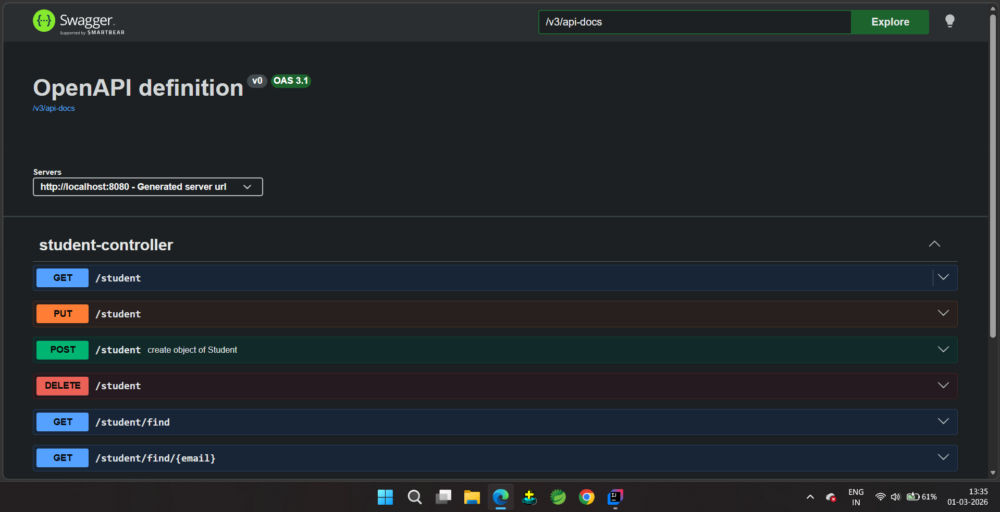
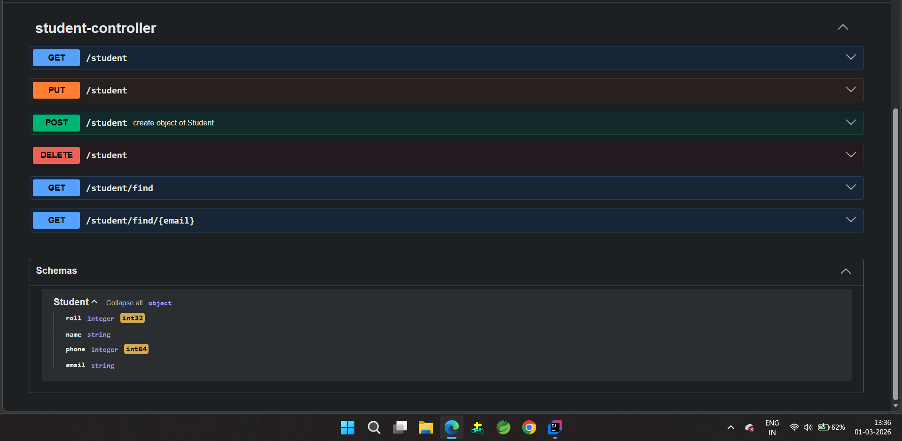

# Student CRUD Project

This is a **Spring Boot** project for managing **Student** records with full **CRUD operations**. The project uses **PostgreSQL** for persistent storage and **Swagger (OpenAPI)** for API documentation and testing.

---

## 🛠️ Technology Stack

- **Backend:** Java, Spring Boot  
- **Database:** PostgreSQL  
- **API Documentation:** Swagger (OpenAPI)  
- **Build Tool:** Maven  

---

## 🚀 Features

- Create, read, update, and delete student records  
- Fetch student by roll number or email  
- Interactive API documentation via Swagger UI  
- Persistent storage using PostgreSQL  

---

## 📘 API Documentation (Swagger)

Swagger provides a browser-based interface to:

- View all endpoints with request and response details  
- Test APIs directly from the browser  
- Understand validation rules and models  

### 🔗 Access Swagger UI

After running the application locally, open the following URL in your browser:
### URL : **http://localhost:8080/swagger-ui/index.html**

## 📸 Swagger UI – Student Endpoints

This screenshot shows all available Student API endpoints.

## 📸 Swagger UI – Student Schema

This screenshot shows the Student model structure (roll, name, phone, email).

## 🔹 API Endpoints

| HTTP Method | URL                      | Description                        |
|-------------|--------------------------|------------------------------------|
| POST        | `/student`               | Create a new student               |
| GET         | `/student`               | Find a student by roll number      |
| GET         | `/student/find`          | Get all students                   |
| PUT         | `/student`               | Update an existing student         |
| DELETE      | `/student`               | Delete a student by roll number    |
| GET         | `/student/find/{email}`  | Find students by email             |

## 🔹 Student Schema

The `Student` entity contains the following fields:

| Field  | Type    | Description              |
|--------|---------|--------------------------|
| roll   | int     | Unique roll number       |
| name   | String  | Student name             |
| phone  | long    | Student phone number     |
| email  | String  | Student email address    |
